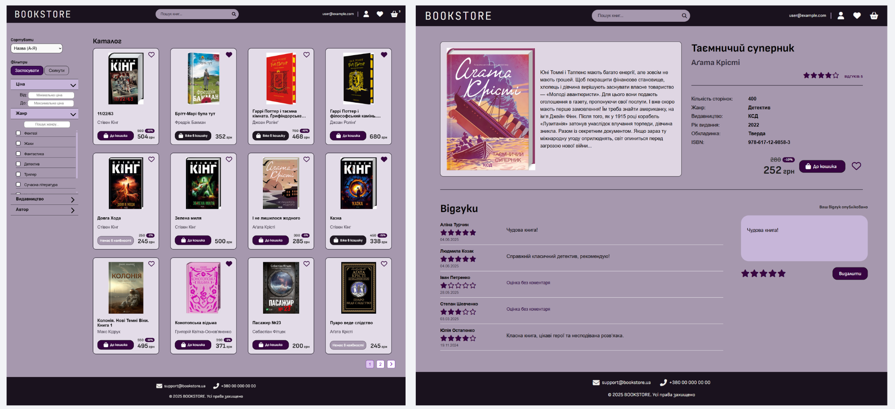
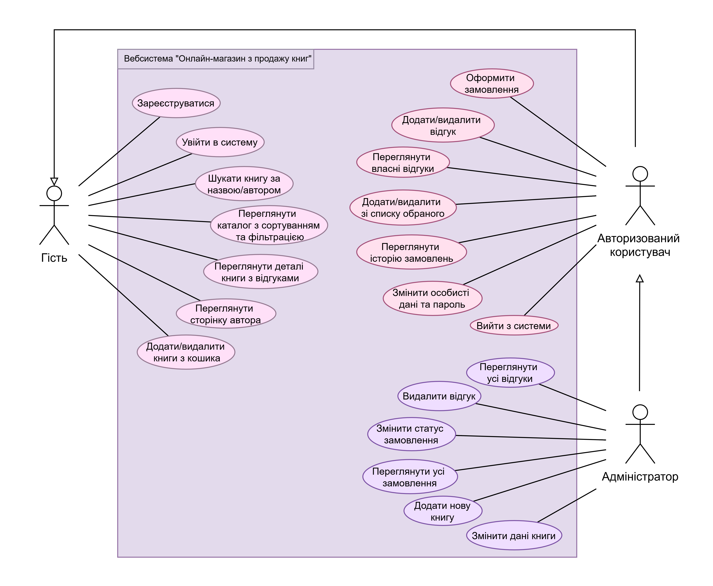
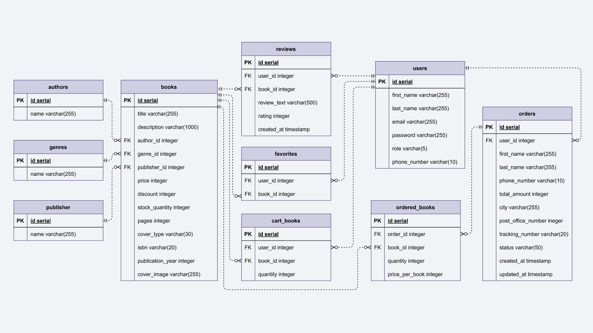

#  Online Book Store Web Application

## Project Overview

#### This is a full-stack web application for an Online Book Store developed with Spring Boot.

This project was created as a [**Bachelor’s thesis in Computer Science**](https://essuir.sumdu.edu.ua/server/api/core/bitstreams/fa5f7520-d9d1-4c5e-b3c4-053b1e1ced8e/content).

Users can browse and search the catalog, filter books, manage a shopping cart, place orders, and leave reviews or save favorites.
The system implements role-based access for guests, registered users, and administrators, following a layered MVC architecture and modern Java development standards.




## Technologies and Tools

- **Backend**:
    - **Java 17** — Object-oriented programming language
    - **Spring Boot** — Main framework for application development
    - **Spring MVC** — Web layer architecture (MVC pattern)
    - **Spring Data JPA** — ORM-based database interaction
    - **Spring Security** — Authentication and authorization


-  **Database**
    - **PostgreSQL** — Relational database management system


- **Frontend**:
    - **Thymeleaf** — шаблонізатор для генерації HTML-сторінок.
    - **CSS** — для стилізації інтерфейсу.
    - **JavaScript** — для інтерактивності і роботи з клієнтською частиною.


- **Tools & Version Control**:
    - **Maven** — build automation and dependency management
    - **Git / GitHub** — version control system
    - **IntelliJ IDEA** — development environment


---
## User Roles and Functionality

### Guest (Unauthenticated User)
- Register in the system
- Log in to the account
- Search books by title or author
- Browse catalog with sorting and filtering
- View book details and reviews
- View author page
- Add/remove books from cart

### Authenticated User
Includes all guest features plus:
- Place orders
- Add and delete reviews
- View personal reviews
- Add/remove books from favorites
- View order history
- Update personal information and password
- Log out

### Administrator
Includes all authenticated user features plus:
- View all user reviews
- Delete reviews (moderation)
- Change order status
- View all system orders
- Add new books to catalog
- Edit book information

**Use Case Diagram:**




---
## Architecture

The application is built using a **layered architecture** based on the **MVC (Model–View–Controller)** pattern, which ensures clear separation of concerns and improves maintainability.

### Application Layers

- **Presentation Layer (Controller)**
  Handles incoming HTTP requests, processes user input, and returns responses using Thymeleaf views or data objects.

- **Service Layer**
  Contains the business logic of the application. It processes data received from controllers and interacts with repositories.

- **Data Access Layer (Repository)**
  Provides communication with the database using Spring Data JPA. Responsible for CRUD operations.

- **Domain Layer (Entity)**
  Represents the core data model of the system and maps database tables to Java objects.

### Request Flow

1. Client sends an HTTP request
2. Controller receives the request
3. Service layer processes business logic
4. Repository interacts with the database
5. Data is returned back through the layers to the client


### Security Layer

The application uses **Spring Security** for authentication and authorization, providing role-based access control for:
- Guest users
- Authenticated users
- Administrators

---

## Project Structure

All Java classes are located in the main package `org.example.bookstore`.  
This package is divided into subpackages based on the purpose of the classes:

- **entity** – entities representing the data models
- **repository** – repositories responsible for database access
- **service** – services that handle business logic and data processing
- **controller** – controllers that handle HTTP requests
- **config** – configuration classes, including Spring Security setup

The main class `BookApplication` is located separately.  
It is annotated with `@SpringBootApplication` and contains the `main()` method, which serves as the application entry point.

In the `resources` folder, you will find:

- **Thymeleaf templates** – HTML views
- **CSS and JS files** – front-end assets
- **application.properties** – Spring Boot configuration, including database connection settings
---

## Database Structure

The database consists of the following tables:

- **books** – stores information about books
- **authors** – stores authors’ data
- **genres** – stores book genres
- **publishers** – stores publishing houses
- **users** – stores registered users of the system
- **reviews** – stores user reviews for books
- **orders** – stores user orders
- **ordered_books** – stores books included in each order
- **cart_books** – stores books added to the shopping cart
- **favorites** – stores books marked as favorites by users

**Entity-Relationship Diagram:**




## Environment Setup and Running the Application
### Requirements

Before running the project, ensure that the following are installed:

- Java 17 or higher
- PostgreSQL 12 or higher
- IDE (recommended: IntelliJ IDEA)


### 1. Cloning the Repository

To get a local copy of the project, follow these steps:

1. Copy the repository link.
2. Open a terminal and run:

```bash
git clone [repository-link]
cd bookstore
```

### 2. Configuring PostgreSQL Database Connection

1. **Make sure PostgreSQL is installed and configured.**

    * If PostgreSQL is not installed, download it from [the official website](https://www.postgresql.org/download/).
    * If you do not have a database created, open SQL Shell (psql) and connect to PostgreSQL.
      To create a new database, run:
   
    ```bash
       CREATE DATABASE book;
      ```


2. **Save the file `application-example.properties` as `application.properties`.**


3. **Update `application.properties` with your database credentials.**

   Open `application.properties` and replace the connection parameters:

   ```properties
   spring.datasource.url=jdbc:postgresql://localhost:5432/database_name
   spring.datasource.username=db_username
   spring.datasource.password=db_password
   ```

    - Replace `database_name` with your database name (e.g., book).
    - Replace `db_username` with your PostgreSQL username.
    - Replace `db_password` with your PostgreSQL password.


4. **Database Table Creation**

   With the configuration: `spring.jpa.hibernate.ddl-auto=update` all required tables will be created automatically in your database during the first application startup.


5. **Verify the Connection**  
   After updating `application.properties`, restart the Spring Boot application.
   If everything is configured correctly, the application will successfully connect to the database.

### 3. Running the Application

* **Via IDE (e.g., IntelliJ IDEA)**
  * Open the project.
  * Run the main class BookstoreApplication.


* **Via Terminal**

  Open a terminal in the project directory and execute:

   ```bash
   ./mvnw spring-boot:run
   ```
  Maven Wrapper (`./mvnw`) allows you to run Maven without prior installation, automatically downloading the required version for the project.

### 4. Accessing the Application

#### After a successful startup, open your browser and go to:

#### http://localhost:8080

---

### Code Documentation with Javadoc

All classes and methods are documented according to the **Javadoc** standard.

**Javadoc** is a documentation format that uses special comments starting with `/**` and ending with `*/`.  
Inside these comments, various tags are used to describe method parameters, return values, exceptions, and other details.

---

## General Documentation Rules

### 1. Class Documentation
Each class should include a comment that describes its main purpose and role in the project.  
The class documentation should be placed directly above the class declaration.

**Example:**

```java
/**
 * Service class responsible for managing books in the system.
 * Provides functionality for searching, filtering, and sorting books,
 * as well as retrieving books by ID or author.
 */
public class BookService {
    ...
}
```

2. **Method Documentation**:

Each method should be clearly documented to explain its purpose, parameters, and return value.

The following Javadoc tags should be used:

- **`@param`**: describes a method parameter
- **`@return`**: describes the returned value
- **`@throws` або `@exception`**: describes possible exceptions thrown by the method

**Приклад**:

```java
/**
 * Finds and returns a book by its unique identifier.
 *
 * @param id the identifier of the book to be retrieved
 * @return the book with the specified identifier
 * @throws RuntimeException if the book with the given ID is not found
 */
public Book getBookById(Long id) { ... }
```

---

## License

This project is licensed under the [MIT License](LICENSE).


